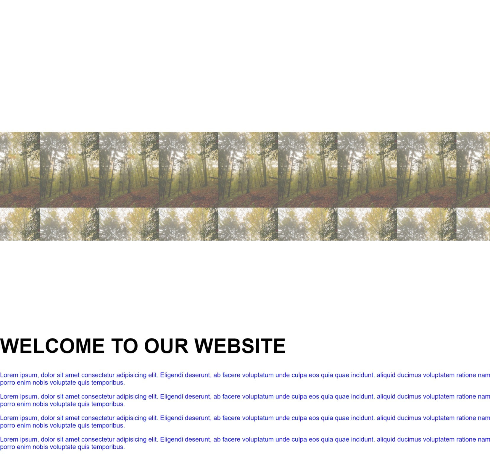

# Background Image Scroll Effects

This project demonstrates background image scroll effects using HTML, CSS, and 
JavaScript.



## Table of Contents
- [Description](#description)
- [Installation](#installation)
- [Usage](#usage)
- [Code Overview](#code-overview)
- [Contributing](#contributing)
- [License](#license)

## Description
This project implements a background image scroll effect. As the user scrolls down the page, the background image provides a dynamic and visually appealing effect. The page contains multiple paragraphs of placeholder text to illustrate the scrolling behavior.

## Installation
1. Clone the repository:
    ```bash
    git clone https://github.com/yourusername/background-image-scroll-effects.git
    ```
2. Navigate to the project directory:
    ```bash
    cd background-image-scroll-effects
    ```

## Usage
1. Open the `index.html` file in your preferred web browser to see the scroll effects in action.
2. Modify the `style.css` and `index.js` files to customize the behavior and appearance of the scroll effects.

## Code Overview
### HTML
The HTML file sets up the structure of the webpage with a background image container and placeholder text.
=======
#Readme File is Added
-readme file
-readme file added by vscode